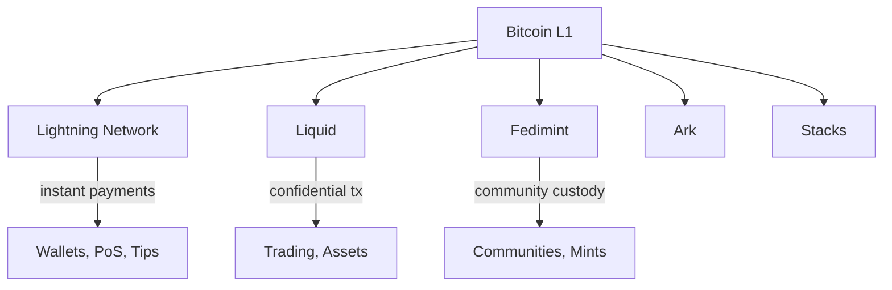

# Sidechains & Layer 2

Bitcoin's base layer processes ~7 transactions per second. To scale to global usage while preserving decentralization, the ecosystem uses layered solutions — each with different trust assumptions, speed, and capabilities.

For deeper coverage of individual protocols, see [Protocols on Bitcoin](/docs/tracks/application-developer/protocols-on-bitcoin).

## The Scaling Landscape

## Lightning Network

The primary L2 solution for instant Bitcoin payments.

| Aspect | Details |
|--------|---------|
| **Type** | Payment channel network |
| **Speed** | Sub-second |
| **Fees** | Typically < 1 sat |
| **Trust** | Trustless (requires monitoring) |
| **Capacity** | Limited by channel liquidity |
| **Best for** | Frequent small payments, streaming sats |

**How it works:** Two parties lock funds in a 2-of-2 multisig on-chain, then exchange signed transactions off-chain. Payments route through multiple channels using HTLCs.

**Implementations:** LND, Core Lightning, Eclair, LDK

**Developer entry point:** [LND API](https://docs.lightning.engineering/) or [LDK](https://lightningdevkit.org/)

## Liquid Network

A federated sidechain by Blockstream.

| Aspect | Details |
|--------|---------|
| **Type** | Federated sidechain |
| **Speed** | ~1 minute blocks |
| **Fees** | Low, fixed |
| **Trust** | Federation of ~65 functionaries |
| **Features** | Confidential Transactions, Issued Assets |
| **Best for** | Trading, asset issuance, privacy |

**How it works:** BTC is pegged in via a federation-controlled multisig. Liquid BTC (L-BTC) exists on the Liquid chain with confidential amounts.

**Developer entry point:** [Liquid Developer Docs](https://docs.liquid.net/)

## Fedimint

A federated custody and e-cash protocol.

| Aspect | Details |
|--------|---------|
| **Type** | Federated e-cash |
| **Speed** | Instant (within mint) |
| **Fees** | Minimal |
| **Trust** | Federation of guardians (threshold) |
| **Features** | Chaumian e-cash, Lightning gateway |
| **Best for** | Communities, custodial wallets, privacy |

**How it works:** A federation holds BTC and issues e-cash tokens. Users transact with unlinkable e-cash. Lightning gateways enable interoperability with the broader network.

**Developer entry point:** [Fedimint GitHub](https://github.com/fedimint/fedimint)

## Ark

An emerging off-chain protocol for shared UTXO management.

| Aspect | Details |
|--------|---------|
| **Type** | Off-chain UTXO protocol |
| **Speed** | Seconds (within rounds) |
| **Trust** | Service provider + timelocks |
| **Features** | No inbound liquidity needed, UTXO-based |
| **Best for** | Onboarding, small payments |
| **Status** | Early development |

**How it works:** An Ark Service Provider (ASP) batches user transactions into periodic on-chain commitments. Users receive virtual UTXOs (vTXOs) that can be redeemed on-chain unilaterally.

## Comparison

| Solution | Speed | Trust Model | Privacy | Capacity |
|----------|-------|-------------|---------|----------|
| **Lightning** | Instant | Trustless | Medium | Channel-limited |
| **Liquid** | ~1 min | Federation | High (CT) | Block-limited |
| **Fedimint** | Instant | Federation | High (e-cash) | Mint-limited |
| **Ark** | Seconds | ASP + timelock | Medium | Round-limited |
| **Stacks** | ~10 min | PoX consensus | Low | Block-limited |

## Choosing a Solution

| If you need... | Consider... |
|----------------|-------------|
| Instant retail payments | Lightning |
| Confidential trading | Liquid |
| Community wallet / bank-like UX | Fedimint |
| Simple onboarding for new users | Ark |
| Smart contracts anchored to Bitcoin | Stacks |

## For Developers

Regardless of which L2 you work with:

- **Understand the trust assumptions** — Every L2 trades some trust for scalability
- **Plan for failure modes** — Channels can close, federations can fail, timelocks expire
- **Test with real Lightning** — Use testnet or signet for realistic Lightning testing
- **Consider UX** — Users shouldn't need to understand the underlying protocol

## Recommended Reading

- [Lightning Network Specification (BOLTs)](https://github.com/lightning/bolts)
- [Liquid Developer Guide](https://docs.liquid.net/)
- [Fedimint Documentation](https://fedimint.org/docs/intro)
- [Ark Protocol](https://arkdev.info/)
- [Bitcoin Layers Comparison](https://www.bitcoinlayers.org/)
