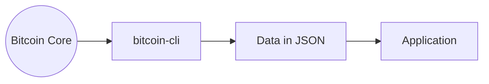
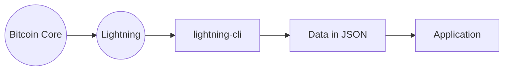

# Environment

To develop Bitcoin and Lightning Network applications, we need a development environment that allows us to connect to the Bitcoin core or the Lightning Network and use its "API," which will provide us with functions to access blockchain data and carry out operations.

:::note
This explanation is simplistic. As we go deeper into the development of BTC, we see that it is a little more complex.
:::

### BTC Apps

Bitcoin CLI is a command line interface allowing us to interact with the blockchain.

### Lightning Network Apps

We also have Lightning CLI.

