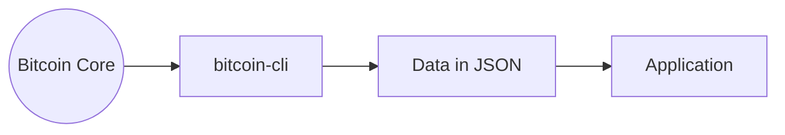
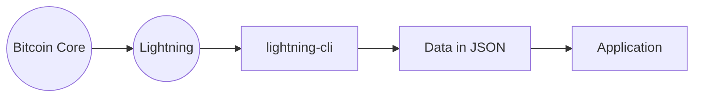

# Welcome

Hello again, and welcome. I'll explain some things you need to know before you start.

To be able to follow these guides without problems you should have some experience as a developer.

However, this does not mean that you will not achieve success by following these guides, you can support yourself with tools such as Chat GPT, search engines or by asking in forums such as reddit/stackoverflow or similar.

## What you'll need
### Nice to have skills:

- Proficient in UNIX-based operating systems (any Linux or MacOS distribution)
- [Terminal skills](https://roadmap.sh/linux) (basic navigation, file editing, shell, permissions, text processing, managing processes and services, etc.)
- Proficient in any programming language ([Python](https://roadmap.sh/python), [Javascript](https://roadmap.sh/javascript), [Rust](https://roadmap.sh/rust), [Go](https://roadmap.sh/golang), [Java](https://roadmap.sh/java), etc.)

:::tip
Even if you do not have 100% of the aforementioned skills, I encourage you to try to complete the guides and tutorials.
:::

### Minimum hardware requirements:

- Operating system: Linux or MacOS
- RAM: 4GB
- CPU: At least 1Ghz quad core
- Storage: 1TB for full node or less for first steps development
- Storage device: SSD

:::info
Right now, any modern computer or some older ones should be enough to follow the guides.
:::

## The development environment

To develop Bitcoin and Lightning Network applications, we need a development environment that allows us to connect to the Bitcoin core or the Lightning Network and use its "API," which will provide us with functions to access blockchain data and carry out operations.

:::note
This explanation is simplistic. As we go deeper into the development of BTC, we see that it is a little more complex.
:::

### BTC Apps

Bitcoin CLI is a command line interface allowing us to interact with the blockchain.

### Lightning Network Apps

We also have Lightning CLI.

