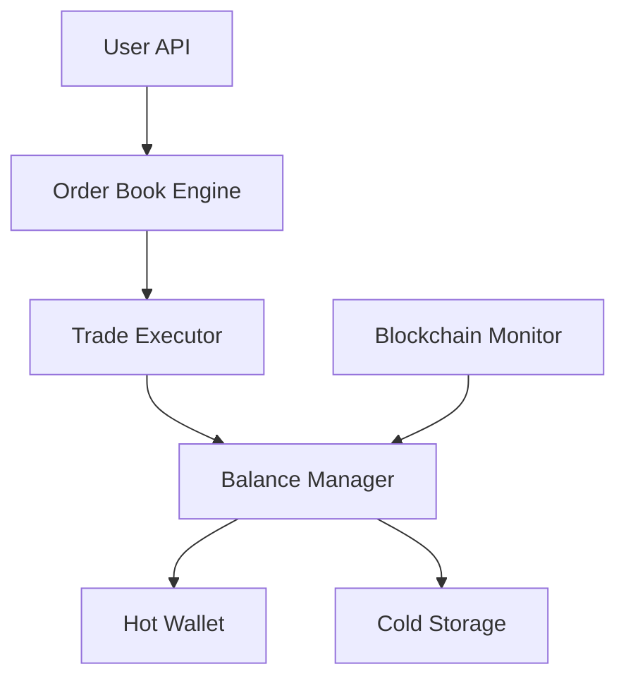

# Exchange & Trading

Building exchange and trading infrastructure is one of the most demanding applications in Bitcoin development. It combines real-time systems, financial security, regulatory compliance, and Bitcoin protocol knowledge.

## Core Components

### Order Book Engine

An exchange's order book matches buy and sell orders:

| Component | Purpose |
|-----------|---------|
| **Matching engine** | Pairs buy/sell orders by price-time priority |
| **Order types** | Market, limit, stop-loss, fill-or-kill |
| **Price feeds** | Aggregate prices from multiple sources |
| **Trade execution** | Settle matched orders, update balances |

### Architecture Overview



## Deposit & Withdrawal

### Deposit Flow

1. Generate a unique deposit address per user (HD wallet derivation)
2. Monitor the blockchain for incoming transactions
3. Wait for sufficient confirmations (typically 3-6)
4. Credit the user's internal balance

### Withdrawal Flow

1. User requests withdrawal to external address
2. Validate address format and amount
3. Apply withdrawal limits and 2FA verification
4. Construct and sign transaction from hot wallet
5. Broadcast and monitor confirmation

### Hot/Cold Wallet Architecture

| Wallet | Purpose | Security |
|--------|---------|----------|
| **Hot wallet** | Automated deposits/withdrawals | Online, holds minimal funds |
| **Warm wallet** | Buffer between hot and cold | Semi-automated, intermediate amounts |
| **Cold storage** | Long-term storage | Offline, multisig, holds majority of funds |

Rule of thumb: **Hot wallet should hold only enough for 1-2 days of withdrawals.**

## API Design

Exchange APIs typically provide:

```
REST API:
  GET  /api/v1/ticker          # Current price
  GET  /api/v1/orderbook       # Open orders
  POST /api/v1/order           # Place order
  GET  /api/v1/trades          # Trade history
  GET  /api/v1/balance         # User balance
  POST /api/v1/withdraw        # Request withdrawal

WebSocket:
  ws://exchange/stream/trades   # Real-time trades
  ws://exchange/stream/orderbook # Order book updates
```

## Security Considerations

- **Multi-signature cold storage** — Require multiple approvals for cold storage access
- **Rate limiting** — Protect APIs from abuse
- **Withdrawal delays** — Allow time to detect unauthorized access
- **Address whitelisting** — Users pre-approve withdrawal addresses
- **Regular audits** — Proof of reserves, security audits
- **Insurance** — Cover potential losses from hacks

## Recommended Reading

- [River Financial Engineering Blog](https://river.com/learn/) — Exchange infrastructure insights
- [Kraken Security Practices](https://www.kraken.com/features/security) — Industry security standards
- [Bitcoin Custody Best Practices](https://keys.casa/blog/) — Multi-key security
