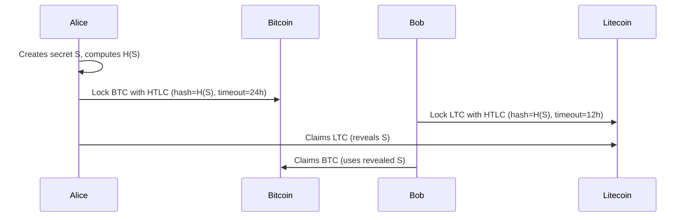

# Advanced Protocols

Bitcoin Script enables powerful transaction patterns beyond simple payments. These building blocks are the foundation of more complex applications like Lightning, exchanges, and collaborative custody.

## Multisig

Multisig (multi-signature) requires multiple private keys to authorize a transaction. This is fundamental to collaborative custody and organizational wallets.

### M-of-N Multisig

An M-of-N scheme requires M signatures out of N total keys:

| Setup | Use Case |
|-------|----------|
| **2-of-3** | Personal security (you hold 2 keys, backup service holds 1) |
| **3-of-5** | Corporate treasury (requires majority approval) |
| **2-of-2** | Lightning payment channels |
| **1-of-2** | Shared access (either party can spend) |

### Implementation Approaches

- **P2SH multisig** — Legacy, limited to 15 keys
- **P2WSH multisig** — SegWit, more efficient
- **MuSig2 (Taproot)** — Key aggregation, looks like a single-sig on-chain (better privacy and lower fees)

### PSBT Multisig Workflow

```
1. Creator builds unsigned transaction (PSBT)
2. Send PSBT to Signer A → signs with their key
3. Send partially-signed PSBT to Signer B → signs with their key
4. Combiner merges signatures
5. Finalizer completes the transaction
6. Broadcast
```

## Timelocks

Timelocks restrict when a transaction can be confirmed:

### Absolute Timelocks (CLTV)

`OP_CHECKLOCKTIMEVERIFY` prevents spending before a specific block height or timestamp:

```
# Can't spend before block 800000
OP_CHECKLOCKTIMEVERIFY OP_DROP <pubkey> OP_CHECKSIG
```

**Use cases:** Trust fund releases, scheduled payments, dead man's switches

### Relative Timelocks (CSV)

`OP_CHECKSEQUENCEVERIFY` prevents spending until a certain number of blocks have passed since the UTXO was created:

```
# Can't spend until 144 blocks (~1 day) after creation
OP_CHECKSEQUENCEVERIFY OP_DROP <pubkey> OP_CHECKSIG
```

**Use cases:** Lightning commitment transactions, revocation paths, cooling-off periods

## Atomic Swaps

Atomic swaps enable trustless exchange of cryptocurrencies across different blockchains using Hash Time-Locked Contracts (HTLCs).

### How HTLCs Work



If either party disappears, the timelocks ensure funds are returned.

### Submarine Swaps

Submarine swaps exchange on-chain Bitcoin for Lightning payments (or vice versa):

- **On-chain → Lightning:** Pay an on-chain HTLC, receive a Lightning payment
- **Lightning → On-chain:** Pay a Lightning invoice, receive an on-chain UTXO

Services like [Boltz](https://boltz.exchange/) facilitate submarine swaps.

## Covenants

Covenants restrict how a UTXO can be spent (not just who can spend it). They're an active area of research:

| Proposal | Mechanism |
|----------|-----------|
| **OP_CTV** (BIP-119) | Commit to the exact transaction that spends the output |
| **OP_VAULT** | Purpose-built vault construction |
| **OP_CAT** | Enable arbitrary covenant logic via script composition |

**Use cases:** Vaults (delayed withdrawals with clawback), congestion control, payment pools

## CoinJoin

CoinJoin is a privacy technique where multiple users combine their transactions:

1. Multiple users provide inputs
2. A coordinator constructs a transaction with uniform outputs
3. Each user signs their inputs
4. The combined transaction is broadcast

Tools: [Joinmarket](https://github.com/JoinMarket-Org/joinmarket-clientserver), [Wasabi Wallet](https://wasabiwallet.io/)

## Recommended Reading

- [Bitcoin Script Wiki](https://en.bitcoin.it/wiki/Script)
- [BIP-65: CLTV](https://github.com/bitcoin/bips/blob/master/bip-0065.mediawiki)
- [BIP-68/112: CSV](https://github.com/bitcoin/bips/blob/master/bip-0068.mediawiki)
- [Atomic Swap Explanation](https://en.bitcoin.it/wiki/Atomic_swap)
- [BIP-119: OP_CTV](https://github.com/bitcoin/bips/blob/master/bip-0119.mediawiki)
