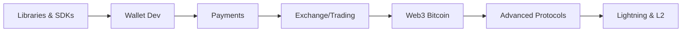

# Application Developer Track

Application developers build the products and services that people use to interact with Bitcoin — wallets, payment processors, exchanges, Lightning apps, and more. This is the broadest track, touching web development, mobile, backend systems, and cryptographic protocols.

## What You'll Learn

1. **Libraries & SDKs** — Bitcoin development libraries across multiple languages
2. **Wallet Development** — HD wallets, key management, coin selection
3. **Payment Processing** — Invoicing, payment flows, Lightning integration
4. **Exchange & Trading** — Order books, APIs, custody solutions
5. **Web3 on Bitcoin** — DLCs, Stacks, RGB protocol
6. **Advanced Protocols** — Multisig, timelocks, atomic swaps
7. **Protocols on Bitcoin** — Lightning Network, sidechains, Nostr

## Prerequisites

Complete the [Fundamentals](/docs/fundamentals/prerequisites) section and be comfortable with:

- At least one of: JavaScript/TypeScript, Python, Rust, or Go
- REST APIs and web development basics
- Basic understanding of Bitcoin transactions and addresses
- Command-line Bitcoin operations (bitcoin-cli)

## Key Skills You'll Develop

| Skill | Why It Matters |
|-------|---------------|
| Bitcoin library proficiency | Build applications without touching raw protocol |
| Wallet architecture | Secure key management is the foundation of everything |
| Payment flow design | Users need reliable, intuitive payment experiences |
| Lightning integration | Layer 2 enables instant, cheap payments |
| Security mindset | You're handling real money — mistakes are costly |

## Learning Path



## Quick Start

The fastest way to start building is to pick a library in your preferred language and build a simple wallet on regtest:

```bash
# Start a regtest node
bitcoind -regtest -daemon

# Your first app can:
# 1. Generate a new address
# 2. Mine some blocks (regtest only)
# 3. Send a transaction
# 4. Check the balance
```

Check the [Libraries & SDKs](/docs/tracks/application-developer/libraries-sdks) section to pick your starting point.

## Resources

- [Bitcoin Developer Guide](https://developer.bitcoin.org/devguide/)
- [Learning Bitcoin from the Command Line](https://github.com/BlockchainCommons/Learning-Bitcoin-from-the-Command-Line)
- [Bitcoin Design Guide](https://bitcoin.design/guide/) — UX patterns for Bitcoin applications
- [Lightning Dev Kit (LDK)](https://lightningdevkit.org/) — Build custom Lightning implementations
