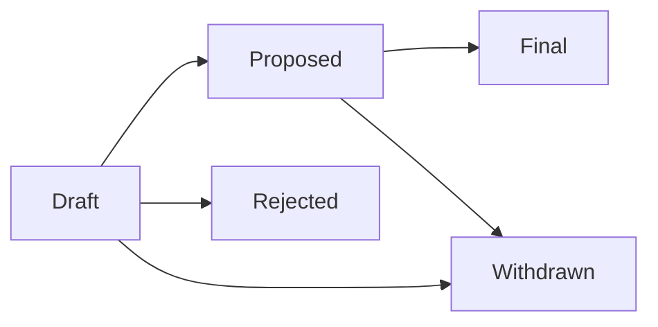

# Bitcoin Improvement Proposals (BIPs)

BIPs are the formal mechanism for proposing changes to Bitcoin. Understanding the BIP process is essential for anyone working on Bitcoin's protocol — whether you're writing a proposal or implementing one.

## What Is a BIP?

A BIP is a design document that describes a new feature, process, or informational topic for the Bitcoin community. The process was modeled after Python's PEP system and was introduced by Amir Taaki in [BIP-1](https://github.com/bitcoin/bips/blob/master/bip-0001.mediawiki) (2011).

## BIP Types

| Type | Purpose | Example |
|------|---------|---------|
| **Standards Track** | Changes to the network protocol, transaction validation, or block format | BIP-141 (SegWit) |
| **Informational** | Design guidance or general information | BIP-32 (HD Wallets) |
| **Process** | Changes to the BIP process itself or development workflows | BIP-2 (BIP Process) |

## The BIP Lifecycle

1. **Draft** — Author writes the BIP and submits a PR to the [bips repository](https://github.com/bitcoin/bips)
2. **Proposed** — BIP is assigned a number and is open for community discussion
3. **Final** — BIP is adopted (for Standards Track, this means activation on the network)
4. **Withdrawn/Rejected** — Author or community decides not to proceed

## Notable BIPs Every Protocol Developer Should Know

### Wallet & Address Standards

| BIP | Title | Impact |
|-----|-------|--------|
| BIP-32 | HD Wallets | Hierarchical deterministic key derivation |
| BIP-39 | Mnemonic Seed Phrases | 12/24-word recovery phrases |
| BIP-44 | Multi-account HD structure | Standard derivation paths |
| BIP-84 | Native SegWit derivation | `bc1q` addresses |
| BIP-86 | Taproot derivation | `bc1p` addresses |

### Protocol Upgrades

| BIP | Title | Impact |
|-----|-------|--------|
| BIP-16 | P2SH | Pay-to-Script-Hash |
| BIP-65 | CLTV | Absolute timelocks |
| BIP-68 | Sequence locks | Relative timelocks |
| BIP-141 | SegWit | Witness data separation |
| BIP-143 | SegWit transaction signing | New sighash algorithm |
| BIP-340 | Schnorr Signatures | Efficient, aggregatable signatures |
| BIP-341 | Taproot | MAST + Schnorr key spend |
| BIP-342 | Tapscript | Script upgrades for Taproot |

### Network & P2P

| BIP | Title | Impact |
|-----|-------|--------|
| BIP-37 | Bloom Filters | SPV node privacy (deprecated) |
| BIP-152 | Compact Blocks | Faster block relay |
| BIP-155 | addrv2 | Support for Tor v3, I2P |
| BIP-324 | v2 P2P Transport | Encrypted P2P connections |

## Reading a BIP

Every BIP follows a standard structure:

- **Preamble** — Metadata (BIP number, title, author, status, type)
- **Abstract** — Short summary
- **Motivation** — Why this change is needed
- **Specification** — Exact technical specification
- **Rationale** — Design decisions explained
- **Backwards Compatibility** — Impact on existing software
- **Reference Implementation** — Working code (often a Bitcoin Core PR)

## Writing a BIP

If you're considering writing a BIP:

1. Discuss the idea on the [bitcoin-dev mailing list](https://groups.google.com/g/bitcoindev) or [Delving Bitcoin](https://delvingbitcoin.org/) first
2. Get informal feedback before writing the full proposal
3. Follow the format defined in [BIP-2](https://github.com/bitcoin/bips/blob/master/bip-0002.mediawiki)
4. Submit as a PR to the bips repository
5. Be prepared for extensive review and iteration

## Recommended Reading

- [BIP Repository](https://github.com/bitcoin/bips)
- [BIP-2: BIP Process](https://github.com/bitcoin/bips/blob/master/bip-0002.mediawiki)
- [Bitcoin Optech Topics](https://bitcoinops.org/en/topics/) — Detailed explanations of BIP-related topics
