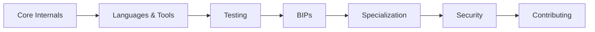

# Protocol Developer Track

Protocol developers work at the deepest layer of Bitcoin — the consensus rules, peer-to-peer networking, transaction validation, and the codebase that powers every full node on the network.

## What You'll Learn

This track takes you from understanding Bitcoin Core's architecture to being able to contribute to the project:

1. **Bitcoin Core Internals** — Source code structure, build system, key modules
2. **Languages & Tools** — C++, Python testing framework, debugging tools
3. **Testing** — Functional tests, fuzz testing, CI infrastructure
4. **BIPs** — The Bitcoin Improvement Proposal process
5. **Specialization Areas** — P2P networking, mempool policy, wallet, mining
6. **Security & Cryptography** — Threat models, cryptographic primitives used in Bitcoin
7. **Contributing to Bitcoin Core** — Review process, PR workflow, community norms

## Prerequisites

Before starting this track, you should have completed the [Fundamentals](/docs/fundamentals/prerequisites) section and be comfortable with:

- C++ (at least intermediate level)
- Git and GitHub workflows
- Command-line development tools
- Basic understanding of Bitcoin's architecture (UTXO model, transactions, Script)

## Key Skills You'll Develop

| Skill | Why It Matters |
|-------|---------------|
| C++ proficiency | Bitcoin Core is ~300k+ lines of C++ |
| Consensus understanding | One bug can split the network |
| Code review | Most Core contributors spend more time reviewing than writing |
| Cryptographic reasoning | Signatures, hashes, and proofs are everywhere |
| Test writing | Every change needs comprehensive tests |

## Learning Path

## Resources to Start With

- [Bitcoin Core GitHub Repository](https://github.com/bitcoin/bitcoin)
- [Bitcoin Core Developer Documentation](https://github.com/bitcoin/bitcoin/tree/master/doc)
- [Chaincode Labs Seminars](https://chaincode.com/)
- [Bitcoin Optech](https://bitcoinops.org/) — Weekly newsletter on protocol developments
