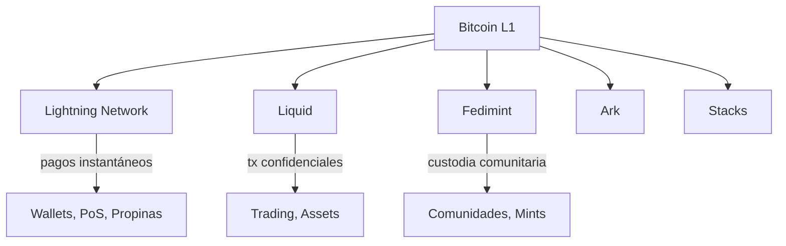

# Sidechains y Layer 2

La capa base de Bitcoin procesa ~7 transacciones por segundo. Para escalar a uso global preservando la descentralización, el ecosistema utiliza soluciones en capas — cada una con diferentes supuestos de confianza, velocidad y capacidades.

Para cobertura más profunda de protocolos individuales, consulta [Protocolos sobre Bitcoin](/docs/tracks/application-developer/protocols-on-bitcoin).

## El Panorama de Escalabilidad

## Lightning Network

La solución L2 principal para pagos instantáneos con Bitcoin.

| Aspecto | Detalles |
|---------|----------|
| **Tipo** | Red de canales de pago |
| **Velocidad** | Sub-segundo |
| **Comisiones** | Típicamente < 1 sat |
| **Confianza** | Sin confianza (requiere monitoreo) |
| **Capacidad** | Limitada por liquidez del canal |
| **Ideal para** | Pagos pequeños frecuentes, streaming sats |

**Cómo funciona:** Dos partes bloquean fondos en un multisig 2-de-2 on-chain, luego intercambian transacciones firmadas off-chain. Los pagos se enrutan a través de múltiples canales usando HTLCs.

**Implementaciones:** LND, Core Lightning, Eclair, LDK

**Punto de entrada para desarrolladores:** [LND API](https://docs.lightning.engineering/) o [LDK](https://lightningdevkit.org/)

## Liquid Network

Una sidechain federada de Blockstream.

| Aspecto | Detalles |
|---------|----------|
| **Tipo** | Sidechain federada |
| **Velocidad** | Bloques de ~1 minuto |
| **Comisiones** | Bajas, fijas |
| **Confianza** | Federación de ~65 funcionarios |
| **Características** | Confidential Transactions, Issued Assets |
| **Ideal para** | Trading, emisión de activos, privacidad |

**Cómo funciona:** BTC se vincula mediante un multisig controlado por la federación. Liquid BTC (L-BTC) existe en la cadena Liquid con montos confidenciales.

**Punto de entrada para desarrolladores:** [Liquid Developer Docs](https://docs.liquid.net/)

## Fedimint

Un protocolo federado de custodia y e-cash.

| Aspecto | Detalles |
|---------|----------|
| **Tipo** | E-cash federado |
| **Velocidad** | Instantáneo (dentro del mint) |
| **Comisiones** | Mínimas |
| **Confianza** | Federación de guardianes (umbral) |
| **Características** | E-cash Chaumian, gateway Lightning |
| **Ideal para** | Comunidades, wallets custodiados, privacidad |

**Cómo funciona:** Una federación mantiene BTC y emite tokens de e-cash. Los usuarios transaccionan con e-cash no vinculable. Los gateways Lightning permiten interoperabilidad con la red más amplia.

**Punto de entrada para desarrolladores:** [Fedimint GitHub](https://github.com/fedimint/fedimint)

## Ark

Un protocolo emergente off-chain para gestión compartida de UTXOs.

| Aspecto | Detalles |
|---------|----------|
| **Tipo** | Protocolo UTXO off-chain |
| **Velocidad** | Segundos (dentro de rondas) |
| **Confianza** | Proveedor de servicio + timelocks |
| **Características** | Sin necesidad de liquidez entrante, basado en UTXO |
| **Ideal para** | Onboarding, pagos pequeños |
| **Estado** | Desarrollo temprano |

**Cómo funciona:** Un Ark Service Provider (ASP) agrupa transacciones de usuarios en compromisos periódicos on-chain. Los usuarios reciben UTXOs virtuales (vTXOs) que pueden redimirse on-chain unilateralmente.

## Comparación

| Solución | Velocidad | Modelo de Confianza | Privacidad | Capacidad |
|----------|-----------|---------------------|-----------|-----------|
| **Lightning** | Instantáneo | Sin confianza | Media | Limitada por canal |
| **Liquid** | ~1 min | Federación | Alta (CT) | Limitada por bloque |
| **Fedimint** | Instantáneo | Federación | Alta (e-cash) | Limitada por mint |
| **Ark** | Segundos | ASP + timelock | Media | Limitada por ronda |
| **Stacks** | ~10 min | Consenso PoX | Baja | Limitada por bloque |

## Elegir una Solución

| Si necesitas... | Considera... |
|-----------------|-------------|
| Pagos instantáneos en retail | Lightning |
| Trading confidencial | Liquid |
| Wallet comunitario / UX tipo banco | Fedimint |
| Onboarding simple para nuevos usuarios | Ark |
| Contratos inteligentes anclados a Bitcoin | Stacks |

## Para Desarrolladores

Sin importar con qué L2 trabajes:

- **Entiende los supuestos de confianza** — Cada L2 intercambia algo de confianza por escalabilidad
- **Planea para modos de fallo** — Los canales pueden cerrarse, las federaciones pueden fallar, los timelocks expiran
- **Prueba con Lightning real** — Usa testnet o signet para testing realista de Lightning
- **Considera la UX** — Los usuarios no deberían necesitar entender el protocolo subyacente

## Lectura Recomendada

- [Especificación de Lightning Network (BOLTs)](https://github.com/lightning/bolts)
- [Liquid Developer Guide](https://docs.liquid.net/)
- [Documentación de Fedimint](https://fedimint.org/docs/intro)
- [Ark Protocol](https://arkdev.info/)
- [Bitcoin Layers Comparison](https://www.bitcoinlayers.org/)
