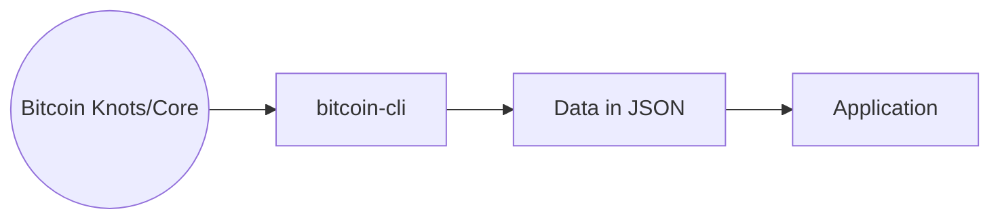
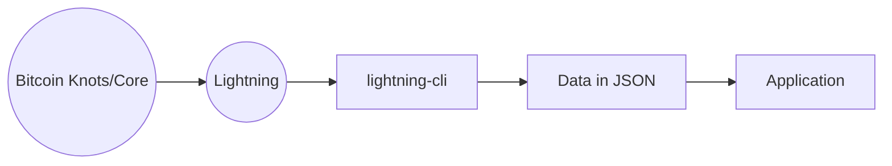

# Entorno

Para desarrollar aplicaciones de Bitcoin y Lightning Network es necesario tener un entorno de desarrollo que permita conectarnos al core de bitcoin o la lightning network y utilizar su "API" que nos aportará funciones para acceder a los datos de la blockchain y realizar otras operaciones.

:::note
Esta explicación es simplista; conforme nos adentremos al desarrollo en BTC veremos que es un poco más complejo.
:::

### BTC Apps

Bitcoin CLI es una interfaz de linea de comandos que nos otorga operatividad para interactuar con la blockchain de Bitcoin.

### Lightning Network Apps

A su vez tenemos Lightning CLI.

