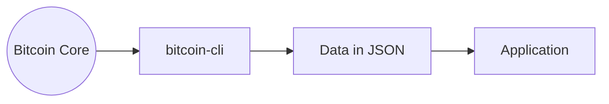
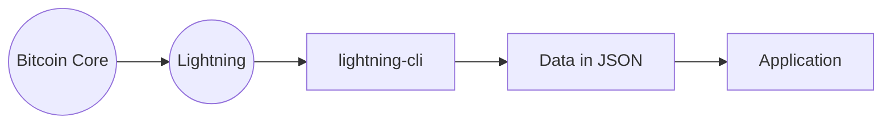

# Bienvenido

Hola de nuevo y bienvenido, aqui te voy a explicar algunas cosas que necesitas saber antes de empezar.

Para poder seguir estas guías sin ningún problema deberas tener cierta experiencia como desarrollador.

Sin embargo esto no quiere decir que no logres el éxito siguiendo estas guías, puedes apoyarte con herramientas como Chat GPT, motores de búsqueda o preguntando en foros como reddit/stackoverflow o similares.

## Lo que necesitas
### Habilidades recomendadas:

- Dominio de sistemas operativos basados en UNIX (cualquier distribución de Linux o MacOS)
- [Manejo de terminal](https://roadmap.sh/linux) (navegación básica, edición de archivos, shell, permisos, procesamiento de texto, manejo de procesos y servicios, etc.)
- Domino en algún lenguaje de programación ([Python](https://roadmap.sh/python), [Javascript](https://roadmap.sh/javascript), [Rust](https://roadmap.sh/rust), [Go](https://roadmap.sh/golang), [Java](https://roadmap.sh/java), etc.)

:::tip
Aunque no tengas al 100% las habilidades mencionadas, te animo a intentar completar las guias y tutoriales. 
:::

### Requerimientos minimos de hardware:

- Sistema operativo: Linux or MacOS
- RAM: 4GB
- CPU: Por lo menos 1Ghz quad core
- Almacenamiento: 1TB para el nodo completo de bitcoin o menos para los primeros pasos de desarrollo
- Dispositivo de almacenamiento: SSD

:::info
Hoy por hoy, cualquier ordenador moderno o algunos que lleven sus años deberían ser suficientes para seguir las guías.
:::

## El ambiente de desarrollo

Para desarrollar aplicaciones de Bitcoin y Lightning Network es necesario tener un entorno de desarrollo que permita conectarnos al core de bitcoin o la lightning network y utilizar su "API" que nos aportará funciones para acceder a los datos de la blockchain y realizar otras operaciones.

:::note
Esta explicacion es simplista, con forme nos adentremos al desarrollo en BTC veremos que es un poco más complejo.
:::

### BTC Apps

Bitcoin CLI es una interfaz de linea de comandos que nos otorga operatividad para interactuar con la blockchain de Bitcoin.

### Lightning Network Apps

A su vez tenemos Lightning CLI.

