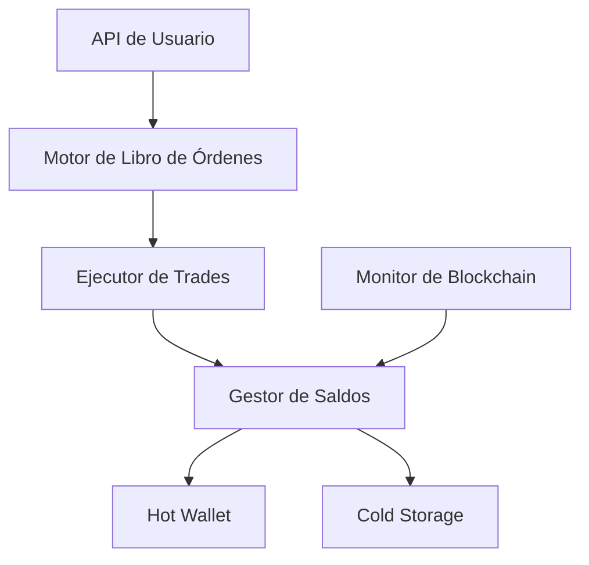

# Exchange y Trading

Construir infraestructura de exchange y trading es una de las aplicaciones más exigentes en el desarrollo Bitcoin. Combina sistemas en tiempo real, seguridad financiera, cumplimiento regulatorio y conocimiento del protocolo Bitcoin.

## Componentes Core

### Motor de Libro de Órdenes

El libro de órdenes de un exchange empareja órdenes de compra y venta:

| Componente | Propósito |
|-----------|-----------|
| **Motor de emparejamiento** | Empareja órdenes de compra/venta por prioridad precio-tiempo |
| **Tipos de orden** | Market, limit, stop-loss, fill-or-kill |
| **Feeds de precio** | Agregar precios de múltiples fuentes |
| **Ejecución de trades** | Liquidar órdenes emparejadas, actualizar saldos |

### Panorama de Arquitectura



## Depósitos y Retiros

### Flujo de Depósito

1. Generar una dirección de depósito única por usuario (derivación HD wallet)
2. Monitorear la blockchain por transacciones entrantes
3. Esperar confirmaciones suficientes (típicamente 3-6)
4. Acreditar el saldo interno del usuario

### Flujo de Retiro

1. El usuario solicita retiro a dirección externa
2. Validar formato de dirección y monto
3. Aplicar límites de retiro y verificación 2FA
4. Construir y firmar transacción desde hot wallet
5. Transmitir y monitorear confirmación

### Arquitectura Hot/Cold Wallet

| Wallet | Propósito | Seguridad |
|--------|-----------|-----------|
| **Hot wallet** | Depósitos/retiros automatizados | Online, mantiene fondos mínimos |
| **Warm wallet** | Buffer entre hot y cold | Semi-automatizado, montos intermedios |
| **Cold storage** | Almacenamiento a largo plazo | Offline, multisig, contiene la mayoría de fondos |

Regla general: **El hot wallet solo debe contener suficiente para 1-2 días de retiros.**

## Diseño de API

Las APIs de exchange típicamente proporcionan:

```
REST API:
  GET  /api/v1/ticker          # Precio actual
  GET  /api/v1/orderbook       # Órdenes abiertas
  POST /api/v1/order           # Colocar orden
  GET  /api/v1/trades          # Historial de trades
  GET  /api/v1/balance         # Saldo del usuario
  POST /api/v1/withdraw        # Solicitar retiro

WebSocket:
  ws://exchange/stream/trades   # Trades en tiempo real
  ws://exchange/stream/orderbook # Actualizaciones del libro de órdenes
```

## Consideraciones de Seguridad

- **Cold storage multi-firma** — Requerir múltiples aprobaciones para acceso a cold storage
- **Limitación de tasa** — Proteger APIs de abuso
- **Retrasos en retiros** — Permitir tiempo para detectar acceso no autorizado
- **Whitelist de direcciones** — Los usuarios pre-aprueban direcciones de retiro
- **Auditorías regulares** — Prueba de reservas, auditorías de seguridad
- **Seguro** — Cubrir pérdidas potenciales por hackeos

## Lectura Recomendada

- [River Financial Engineering Blog](https://river.com/learn/) — Insights de infraestructura de exchange
- [Kraken Security Practices](https://www.kraken.com/features/security) — Estándares de seguridad de la industria
- [Bitcoin Custody Best Practices](https://keys.casa/blog/) — Seguridad multi-clave
