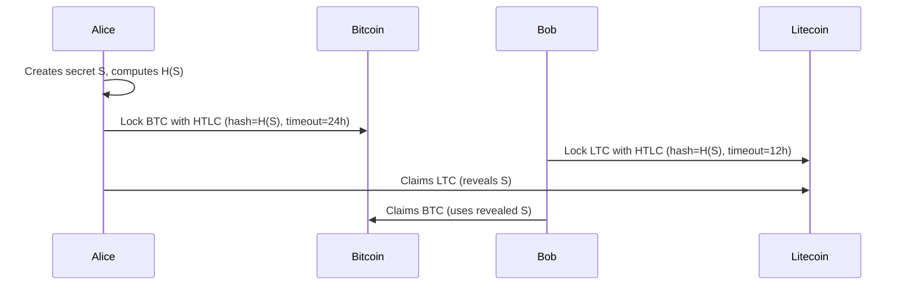

# Protocolos Avanzados

Bitcoin Script permite patrones de transacción poderosos más allá de pagos simples. Estos bloques de construcción son la base de aplicaciones más complejas como Lightning, exchanges y custodia colaborativa.

## Multisig

Multisig (multi-firma) requiere múltiples claves privadas para autorizar una transacción. Es fundamental para custodia colaborativa y wallets organizacionales.

### Multisig M-de-N

Un esquema M-de-N requiere M firmas de N claves totales:

| Configuración | Caso de Uso |
|--------------|-------------|
| **2-de-3** | Seguridad personal (tú tienes 2 claves, servicio de respaldo tiene 1) |
| **3-de-5** | Tesorería corporativa (requiere aprobación mayoritaria) |
| **2-de-2** | Canales de pago Lightning |
| **1-de-2** | Acceso compartido (cualquier parte puede gastar) |

### Enfoques de Implementación

- **P2SH multisig** — Legacy, limitado a 15 claves
- **P2WSH multisig** — SegWit, más eficiente
- **MuSig2 (Taproot)** — Agregación de claves, se ve como single-sig on-chain (mejor privacidad y menores comisiones)

### Flujo de Trabajo Multisig con PSBT

```
1. Creator construye transacción sin firmar (PSBT)
2. Enviar PSBT a Firmante A → firma con su clave
3. Enviar PSBT parcialmente firmado a Firmante B → firma con su clave
4. Combiner fusiona firmas
5. Finalizer completa la transacción
6. Transmitir
```

## Timelocks

Los timelocks restringen cuándo una transacción puede ser confirmada:

### Timelocks Absolutos (CLTV)

`OP_CHECKLOCKTIMEVERIFY` previene el gasto antes de una altura de bloque o timestamp específico:

```
# Can't spend before block 800000
OP_CHECKLOCKTIMEVERIFY OP_DROP <pubkey> OP_CHECKSIG
```

**Casos de uso:** Liberaciones de fondos fiduciarios, pagos programados, dead man's switches

### Timelocks Relativos (CSV)

`OP_CHECKSEQUENCEVERIFY` previene el gasto hasta que un cierto número de bloques haya pasado desde que el UTXO fue creado:

```
# Can't spend until 144 blocks (~1 day) after creation
OP_CHECKSEQUENCEVERIFY OP_DROP <pubkey> OP_CHECKSIG
```

**Casos de uso:** Transacciones de compromiso Lightning, rutas de revocación, períodos de enfriamiento

## Atomic Swaps

Los atomic swaps permiten intercambio sin confianza de criptomonedas entre diferentes blockchains usando Hash Time-Locked Contracts (HTLCs).

### Cómo Funcionan los HTLCs



Si cualquier parte desaparece, los timelocks aseguran que los fondos sean devueltos.

### Submarine Swaps

Los submarine swaps intercambian Bitcoin on-chain por pagos Lightning (o viceversa):

- **On-chain → Lightning:** Pagar un HTLC on-chain, recibir un pago Lightning
- **Lightning → On-chain:** Pagar una factura Lightning, recibir un UTXO on-chain

Servicios como [Boltz](https://boltz.exchange/) facilitan submarine swaps.

## Covenants

Los covenants restringen cómo un UTXO puede gastarse (no solo quién puede gastarlo). Son un área activa de investigación:

| Propuesta | Mecanismo |
|----------|-----------|
| **OP_CTV** (BIP-119) | Comprometerse con la transacción exacta que gasta la salida |
| **OP_VAULT** | Construcción de vault de propósito específico |
| **OP_CAT** | Habilitar lógica de covenant arbitraria vía composición de script |

**Casos de uso:** Vaults (retiros con retraso y recuperación), control de congestión, payment pools

## CoinJoin

CoinJoin es una técnica de privacidad donde múltiples usuarios combinan sus transacciones:

1. Múltiples usuarios proporcionan inputs
2. Un coordinador construye una transacción con outputs uniformes
3. Cada usuario firma sus inputs
4. La transacción combinada se transmite

Herramientas: [Joinmarket](https://github.com/JoinMarket-Org/joinmarket-clientserver), [Wasabi Wallet](https://wasabiwallet.io/)

## Lectura Recomendada

- [Bitcoin Script Wiki](https://en.bitcoin.it/wiki/Script)
- [BIP-65: CLTV](https://github.com/bitcoin/bips/blob/master/bip-0065.mediawiki)
- [BIP-68/112: CSV](https://github.com/bitcoin/bips/blob/master/bip-0068.mediawiki)
- [Atomic Swap Explanation](https://en.bitcoin.it/wiki/Atomic_swap)
- [BIP-119: OP_CTV](https://github.com/bitcoin/bips/blob/master/bip-0119.mediawiki)
