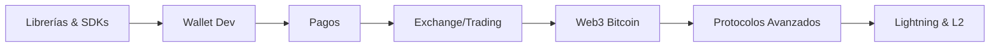

# Track de Desarrollador de Aplicaciones

Los desarrolladores de aplicaciones construyen los productos y servicios que las personas usan para interactuar con Bitcoin — wallets, procesadores de pagos, exchanges, apps Lightning y más. Este es el track más amplio, abarcando desarrollo web, móvil, sistemas backend y protocolos criptográficos.

## Lo Que Aprenderás

1. **Librerías y SDKs** — Librerías de desarrollo Bitcoin en múltiples lenguajes
2. **Desarrollo de Wallets** — HD wallets, gestión de claves, selección de monedas
3. **Procesamiento de Pagos** — Facturación, flujos de pago, integración Lightning
4. **Exchange y Trading** — Libros de órdenes, APIs, soluciones de custodia
5. **Web3 en Bitcoin** — DLCs, Stacks, protocolo RGB
6. **Protocolos Avanzados** — Multisig, timelocks, atomic swaps
7. **Protocolos en Bitcoin** — Lightning Network, sidechains, Nostr

## Prerequisitos

Completa la sección de [Fundamentos](/docs/fundamentals/prerequisites) y ten comodidad con:

- Al menos uno de: JavaScript/TypeScript, Python, Rust o Go
- APIs REST y conceptos básicos de desarrollo web
- Comprensión básica de transacciones y direcciones Bitcoin
- Operaciones Bitcoin desde línea de comandos (bitcoin-cli)

## Habilidades Clave Que Desarrollarás

| Habilidad | Por Qué Importa |
|-----------|-----------------|
| Dominio de librerías Bitcoin | Construir aplicaciones sin tocar el protocolo directamente |
| Arquitectura de wallets | La gestión segura de claves es la base de todo |
| Diseño de flujos de pago | Los usuarios necesitan experiencias de pago confiables e intuitivas |
| Integración Lightning | Layer 2 permite pagos instantáneos y económicos |
| Mentalidad de seguridad | Manejas dinero real — los errores son costosos |

## Ruta de Aprendizaje



## Inicio Rápido

La forma más rápida de empezar a construir es elegir una librería en tu lenguaje preferido y construir un wallet simple en regtest:

```bash
# Iniciar un nodo regtest
bitcoind -regtest -daemon

# Tu primera app puede:
# 1. Generar una nueva dirección
# 2. Minar algunos bloques (solo regtest)
# 3. Enviar una transacción
# 4. Verificar el saldo
```

Revisa la sección de [Librerías y SDKs](/docs/tracks/application-developer/libraries-sdks) para elegir tu punto de partida.

## Recursos

- [Bitcoin Developer Guide](https://developer.bitcoin.org/devguide/)
- [Learning Bitcoin from the Command Line](https://github.com/BlockchainCommons/Learning-Bitcoin-from-the-Command-Line)
- [Bitcoin Design Guide](https://bitcoin.design/guide/) — Patrones de UX para aplicaciones Bitcoin
- [Lightning Dev Kit (LDK)](https://lightningdevkit.org/) — Construye implementaciones Lightning personalizadas
