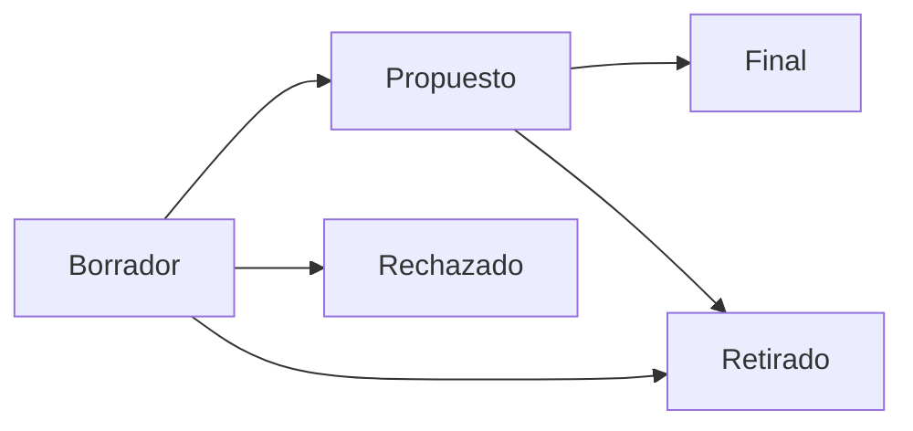

# Bitcoin Improvement Proposals (BIPs)

Los BIPs son el mecanismo formal para proponer cambios a Bitcoin. Entender el proceso de BIPs es esencial para cualquiera que trabaje en el protocolo de Bitcoin — ya sea que estés escribiendo una propuesta o implementando una.

## ¿Qué Es un BIP?

Un BIP es un documento de diseño que describe una nueva característica, proceso o tema informativo para la comunidad Bitcoin. El proceso fue modelado según el sistema PEP de Python y fue introducido por Amir Taaki en [BIP-1](https://github.com/bitcoin/bips/blob/master/bip-0001.mediawiki) (2011).

## Tipos de BIP

| Tipo | Propósito | Ejemplo |
|------|-----------|---------|
| **Standards Track** | Cambios al protocolo de red, validación de transacciones o formato de bloques | BIP-141 (SegWit) |
| **Informational** | Guía de diseño o información general | BIP-32 (HD Wallets) |
| **Process** | Cambios al proceso de BIPs o flujos de desarrollo | BIP-2 (Proceso BIP) |

## El Ciclo de Vida de un BIP

1. **Borrador** — El autor escribe el BIP y envía un PR al [repositorio de bips](https://github.com/bitcoin/bips)
2. **Propuesto** — Se le asigna un número al BIP y se abre para discusión de la comunidad
3. **Final** — El BIP es adoptado (para Standards Track, esto significa activación en la red)
4. **Retirado/Rechazado** — El autor o la comunidad decide no continuar

## BIPs Notables que Todo Desarrollador de Protocolo Debería Conocer

### Estándares de Wallet y Direcciones

| BIP | Título | Impacto |
|-----|--------|---------|
| BIP-32 | HD Wallets | Derivación jerárquica determinística de claves |
| BIP-39 | Frases Semilla Mnemónicas | Frases de recuperación de 12/24 palabras |
| BIP-44 | Estructura HD multi-cuenta | Rutas de derivación estándar |
| BIP-84 | Derivación SegWit nativo | Direcciones `bc1q` |
| BIP-86 | Derivación Taproot | Direcciones `bc1p` |

### Actualizaciones de Protocolo

| BIP | Título | Impacto |
|-----|--------|---------|
| BIP-16 | P2SH | Pay-to-Script-Hash |
| BIP-65 | CLTV | Timelocks absolutos |
| BIP-68 | Sequence locks | Timelocks relativos |
| BIP-141 | SegWit | Separación de datos witness |
| BIP-143 | Firma de transacciones SegWit | Nuevo algoritmo sighash |
| BIP-340 | Firmas Schnorr | Firmas eficientes y agregables |
| BIP-341 | Taproot | MAST + gasto por clave Schnorr |
| BIP-342 | Tapscript | Actualizaciones de script para Taproot |

### Red y P2P

| BIP | Título | Impacto |
|-----|--------|---------|
| BIP-37 | Bloom Filters | Privacidad de nodos SPV (obsoleto) |
| BIP-152 | Compact Blocks | Relay de bloques más rápido |
| BIP-155 | addrv2 | Soporte para Tor v3, I2P |
| BIP-324 | Transporte P2P v2 | Conexiones P2P encriptadas |

## Leer un BIP

Cada BIP sigue una estructura estándar:

- **Preámbulo** — Metadatos (número de BIP, título, autor, estado, tipo)
- **Resumen** — Resumen corto
- **Motivación** — Por qué se necesita este cambio
- **Especificación** — Especificación técnica exacta
- **Razonamiento** — Decisiones de diseño explicadas
- **Compatibilidad hacia atrás** — Impacto en el software existente
- **Implementación de referencia** — Código funcional (frecuentemente un PR de Bitcoin Core)

## Escribir un BIP

Si estás considerando escribir un BIP:

1. Discute la idea en la [lista de correo bitcoin-dev](https://groups.google.com/g/bitcoindev) o [Delving Bitcoin](https://delvingbitcoin.org/) primero
2. Obtén retroalimentación informal antes de escribir la propuesta completa
3. Sigue el formato definido en [BIP-2](https://github.com/bitcoin/bips/blob/master/bip-0002.mediawiki)
4. Envíalo como un PR al repositorio de bips
5. Prepárate para revisión e iteración extensas

## Lectura Recomendada

- [Repositorio de BIPs](https://github.com/bitcoin/bips)
- [BIP-2: Proceso BIP](https://github.com/bitcoin/bips/blob/master/bip-0002.mediawiki)
- [Bitcoin Optech Topics](https://bitcoinops.org/en/topics/) — Explicaciones detalladas de temas relacionados con BIPs
