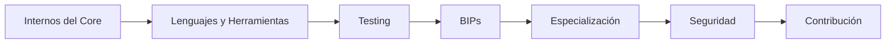

# Track de Desarrollador de Protocolo

Los desarrolladores de protocolo trabajan en la capa más profunda de Bitcoin — las reglas de consenso, la red peer-to-peer, la validación de transacciones y el código que impulsa cada nodo completo en la red.

## Lo Que Aprenderás

Este track te lleva desde entender la arquitectura de Bitcoin Core hasta poder contribuir al proyecto:

1. **Internos de Bitcoin Core** — Estructura del código fuente, sistema de build, módulos clave
2. **Lenguajes y Herramientas** — C++, framework de testing en Python, herramientas de depuración
3. **Testing** — Tests funcionales, fuzz testing, infraestructura de CI
4. **BIPs** — El proceso de Bitcoin Improvement Proposals
5. **Áreas de Especialización** — Red P2P, política de mempool, wallet, minería
6. **Seguridad y Criptografía** — Modelos de amenazas, primitivas criptográficas usadas en Bitcoin
7. **Contribuir a Bitcoin Core** — Proceso de revisión, flujo de PRs, normas de la comunidad

## Prerequisitos

Antes de comenzar este track, deberías haber completado la sección de [Fundamentos](/docs/fundamentals/prerequisites) y sentirte cómodo con:

- C++ (al menos nivel intermedio)
- Git y flujos de trabajo en GitHub
- Herramientas de desarrollo en línea de comandos
- Comprensión básica de la arquitectura de Bitcoin (modelo UTXO, transacciones, Script)

## Habilidades Clave que Desarrollarás

| Habilidad | Por Qué Importa |
|-----------|-----------------|
| Dominio de C++ | Bitcoin Core tiene ~300k+ líneas de C++ |
| Comprensión de consenso | Un bug puede dividir la red |
| Revisión de código | La mayoría de contribuidores de Core pasan más tiempo revisando que escribiendo |
| Razonamiento criptográfico | Firmas, hashes y pruebas están en todas partes |
| Escritura de tests | Cada cambio necesita tests completos |

## Ruta de Aprendizaje

## Recursos para Comenzar

- [Repositorio GitHub de Bitcoin Core](https://github.com/bitcoin/bitcoin)
- [Documentación para Desarrolladores de Bitcoin Core](https://github.com/bitcoin/bitcoin/tree/master/doc)
- [Seminarios de Chaincode Labs](https://chaincode.com/)
- [Bitcoin Optech](https://bitcoinops.org/) — Newsletter semanal sobre desarrollos del protocolo
